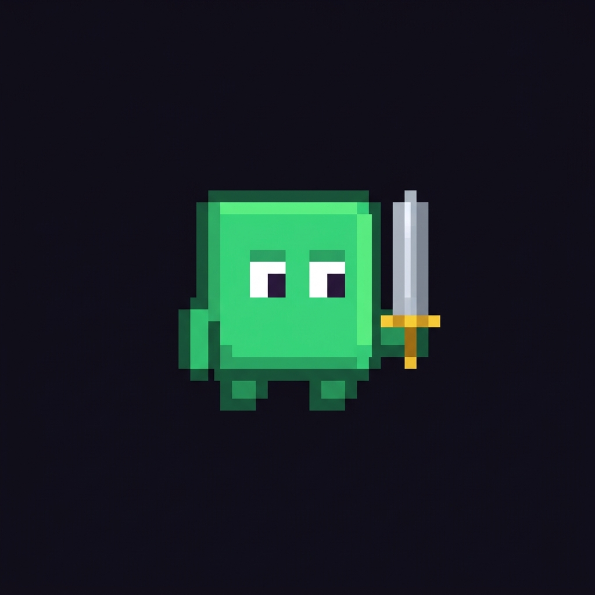

# 🗡️ Pixel Dungeon

**A retro pixel-art dungeon crawler game you can play directly in your browser — free, no download required.**

### ▶️ [Play Now → pixel-dungeon-wheat.vercel.app](https://pixel-dungeon-wheat.vercel.app)



---

## About the Game

**Pixel Dungeon** is a retro-style dungeon crawler made by **Giyan Radhietya**. Explore dangerous dungeons, collect coins, defeat monsters, and find the exit to advance to the next level!

*Pixel Dungeon adalah game petualangan dungeon bergaya retro pixel art yang bisa dimainkan langsung di browser secara gratis. Jelajahi dungeon, kumpulkan koin, kalahkan monster, dan temukan pintu keluar!*

## ✨ Features

- 🎮 Classic grid-based dungeon crawling
- 🪙 Collect coins and chase a high score
- 👾 Fight monsters along the way
- 🗺️ Multiple levels with increasing challenge
- 🔊 Retro sound effects
- 🌐 Runs in any modern browser — desktop & mobile

## 🕹️ Controls

| Action | Key |
|---|---|
| Move | `↑ ↓ ← →` or `W A S D` |
| Attack | `Space` |
| Pause | `Esc` or `P` |

## 🛠️ Built With

- [React](https://react.dev)
- [Vite](https://vite.dev)
- [Tailwind CSS](https://tailwindcss.com)
- Hosted on [Vercel](https://vercel.com)

## 🚀 Run Locally

```bash
git clone https://github.com/GiyanRa/PixelDungeon.git
cd PixelDungeon
npm install
npm run dev
```

## 👤 Author

**Giyan Radhietya** — [GitHub @GiyanRa](https://github.com/GiyanRa)

---

⭐ If you enjoy the game, give this repo a star and share the link: **https://pixel-dungeon-wheat.vercel.app**
